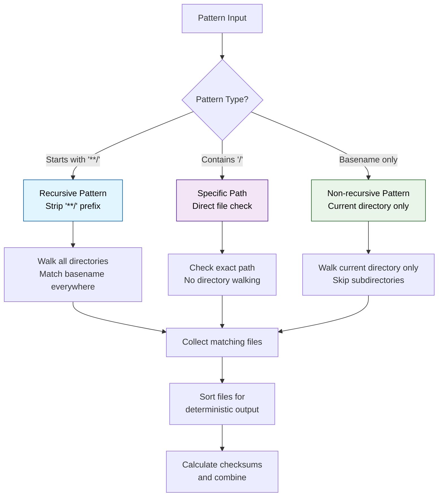

# zstash

WIP of a cache save and restore tool.

# Usage

Restore sub command.

```
Usage: zstash restore --token=STRING [flags]

restore files.

Flags:
  -h, --help                                         Show context-sensitive help.
      --version
      --debug                                        Enable debug mode ($BUILDKITE_ZSTASH_DEBUG).
      --registry-slug="~"                            The registry slug to use ($BUILDKITE_REGISTRY_SLUG).
      --endpoint="https://agent.buildkite.com/v3"    The endpoint to use. Defaults to the Buildkite agent API endpoint ($BUILDKITE_AGENT_API_ENDPOINT).
      --token=STRING                                 The buildkite agent access token to use ($BUILDKITE_AGENT_ACCESS_TOKEN).
      --trace-exporter="noop"                        The trace exporter to use. Defaults to 'noop' ($BUILDKITE_ZSTASH_TRACE_EXPORTER).
      --organization=STRING                          The organization to use ($BUILDKITE_ORGANIZATION_SLUG).
      --branch=STRING                                The branch to use ($BUILDKITE_BRANCH).
      --pipeline=STRING                              The pipeline to use ($BUILDKITE_PIPELINE_SLUG).
      --bucket-url=STRING                            The bucket URL to use ($BUILDKITE_CACHE_BUCKET_URL).
      --prefix=STRING                                The prefix to use ($BUILDKITE_CACHE_PREFIX).
      --format="zip"                                 The format of the archive to use ($BUILDKITE_CACHE_FORMAT).
      --caches=CACHES,...

      --id=ID,...                                    List of comma delimited cache IDs to restore, defaults to all ($BUILDKITE_CACHE_IDS).
```

Save sub command.

```
Usage: zstash save --token=STRING [flags]

save files.

Flags:
  -h, --help                                         Show context-sensitive help.
      --version
      --debug                                        Enable debug mode ($BUILDKITE_ZSTASH_DEBUG).
      --registry-slug="~"                            The registry slug to use ($BUILDKITE_REGISTRY_SLUG).
      --endpoint="https://agent.buildkite.com/v3"    The endpoint to use. Defaults to the Buildkite agent API endpoint ($BUILDKITE_AGENT_API_ENDPOINT).
      --token=STRING                                 The buildkite agent access token to use ($BUILDKITE_AGENT_ACCESS_TOKEN).
      --trace-exporter="noop"                        The trace exporter to use. Defaults to 'noop' ($BUILDKITE_ZSTASH_TRACE_EXPORTER).
      --organization=STRING                          The organization to use ($BUILDKITE_ORGANIZATION_SLUG).
      --branch=STRING                                The branch to use ($BUILDKITE_BRANCH).
      --pipeline=STRING                              The pipeline to use ($BUILDKITE_PIPELINE_SLUG).
      --bucket-url=STRING                            The bucket URL to use ($BUILDKITE_CACHE_BUCKET_URL).
      --prefix=STRING                                The prefix to use ($BUILDKITE_CACHE_PREFIX).
      --format="zip"                                 The format of the archive to use ($BUILDKITE_CACHE_FORMAT).
      --caches=CACHES,...

      --id=ID,...                                    List of comma delimited cache IDs to save, defaults to all ($BUILDKITE_CACHE_IDS).
```

# Cache Key Pattern Matching

zstash supports flexible pattern matching for cache keys with different levels of recursion:

## Pattern Types

- **`package-lock.json`** - Non-recursive, matches files only in the current directory
- **`lib/package-lock.json`** - Specific path, matches the exact file relative to current directory  
- **`**/pom.xml`** - Recursive search, finds `pom.xml` files in any subdirectory

## How Pattern Matching Works



## Examples

```yaml
# Non-recursive - only matches go.mod in current directory
key: "{{ checksum "go.mod" }}"

# Specific path - matches exact file location  
key: "{{ checksum "backend/go.mod" }}"

# Recursive - finds go.mod in any subdirectory
key: "{{ checksum "**/go.mod" }}"

# Multiple patterns
key: "{{ checksum "package.json" "**/yarn.lock" }}"
```

# Verification

To verify the cache and restore worked you can use diff.

```bash
diff --recursive ../vite-artifact-demo/app/node_modules node_modules
```

# Tracing

To enable tracing you need to export the following, to do this you can use [direnv](https://direnv.net/).

The following configuration enables grpc transport and sends the data to [honeycomb](https://www.honeycomb.io/distributed-tracing). Update the `API_TOKEN_HERE` value with the honeycomb api token.

```
export TRACE_EXPORTER=grpc
export OTEL_SERVICE_NAME=zstash
export OTEL_EXPORTER_OTLP_ENDPOINT=https://api.honeycomb.io:443
export OTEL_EXPORTER_OTLP_HEADERS=x-honeycomb-team=API_TOKEN_HERE,x-honeycomb-dataset=dev
```

### Supported Storage Backends

The gocloud.dev implementation supports multiple storage backends:

1. **AWS S3**: `s3://bucket-name?region=us-east-1`
2. **Google Cloud Storage**: `gs://bucket-name` (add `_ "gocloud.dev/blob/gcsblob"`)
3. **Azure Blob Storage**: `azblob://bucket-name` (add `_ "gocloud.dev/blob/azureblob"`)
4. **Local File System**: `file:///path/to/directory` (for testing)

### Adding New Cloud Providers

To add support for a new cloud provider:

1. Import the appropriate gocloud.dev driver:
   ```go
   import _ "gocloud.dev/blob/gcsblob" // For Google Cloud Storage
   ```

2. Use the provider-specific URL format when creating the blob storage.

## 📝 License

MIT © Buildkite

SPDX-License-Identifier: MIT